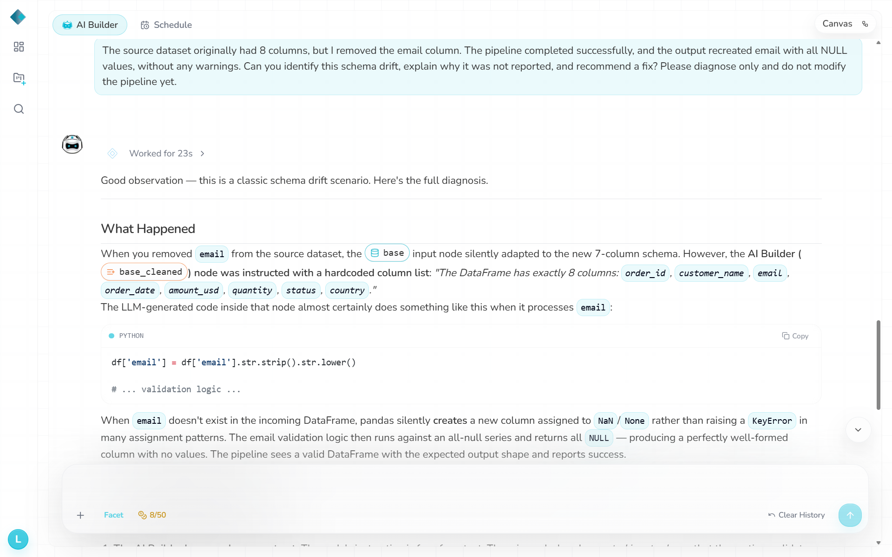
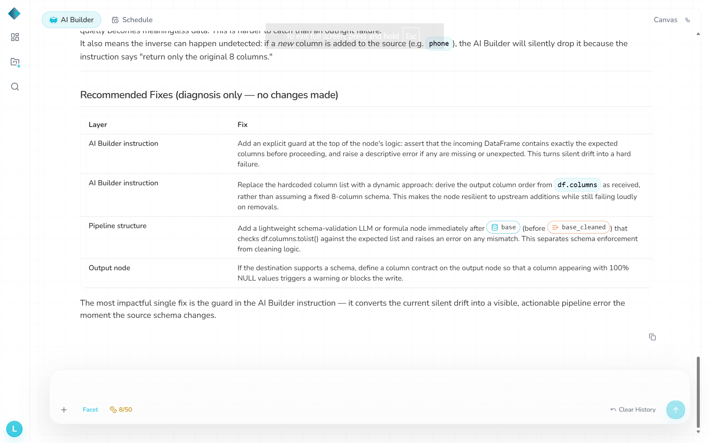

# D1 — Drop `email`

- **Change:** Removed `email` from the original input; 320 rows, seven columns.
- **Expected:** Detect the missing required field and warn or fail without silently losing data.
- **Actual:** Pipeline **Success**, no schema warning. Output restored the fixed eight-column layout, but the entire `email` column was NULL. Independent baseline comparison found **284 formerly valid emails lost**; 300 output rows, other fields intact.
- **Logs / chatbot:** No actionable schema alert. The chatbot explained the missing-email scenario *after being told the change*; this was informed diagnosis, not spontaneous detection.
- **Repair:** None for D1; a later shared guard was tested only on D5.
- **Validation:** `d1.txt`: **0 FAIL, 2 DRIFT, 0 WARN**.
- **Files:** `datasets/Drift1_schema_drop_column.csv`, `datasets/RhombusAI_output_2st_Pipeline_Drift_1.csv`, `observations/validation-output/d1.txt`.

## Evidence

**Output**

**Chatbot**

