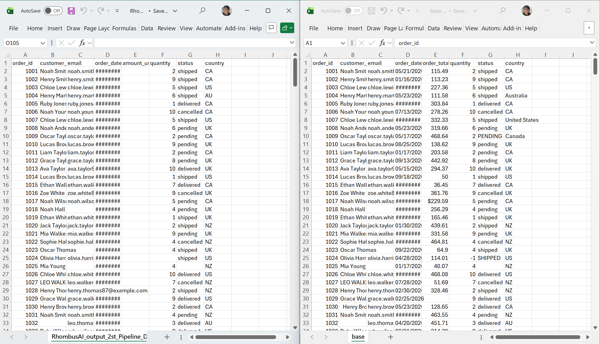
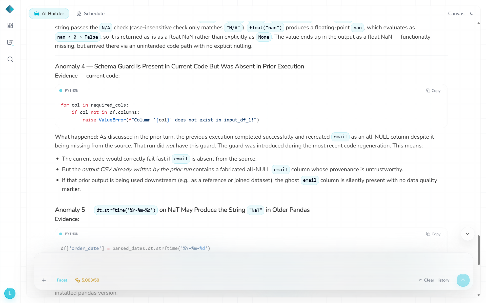

# D2 — Rename `amount_usd`

- **Change:** Renamed `amount_usd` to `order_total_usd`; values unchanged.
- **Expected:** Detect the missing/renamed required field, or explicitly reject an unmapped column.
- **Actual:** Pipeline **Success**, no warning. `amount_usd` was recreated as an all-NULL output column and `order_total_usd` was omitted. **287 valid amounts lost** compared with baseline; row count and other fields unchanged.
- **Logs / chatbot:** No schema alert. Without being told the change, chatbot diagnosis failed to identify the monetary data loss.
- **Repair:** None for D2; one later shared guard was tested only on D5.
- **Validation:** `d2.txt`: **0 FAIL, 2 DRIFT, 0 WARN**.
- **Files:** `datasets/Drift2_schema_rename_column.csv`, `datasets/RhombusAI_output_2st_Pipeline_Drift_2.csv`, `observations/validation-output/d2.txt`.

## Evidence

**Result**

**Chatbot**

