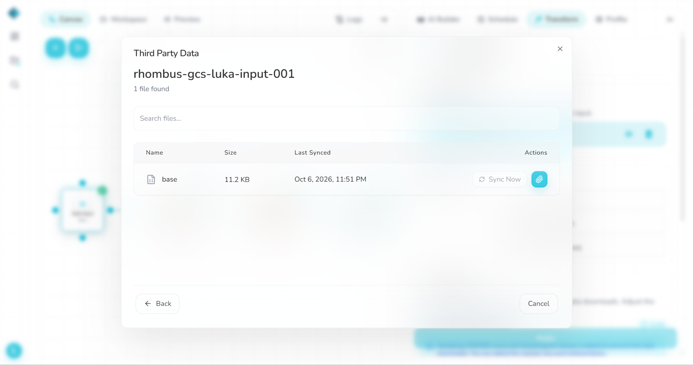
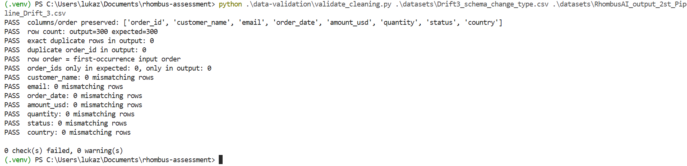

# D3 — Change `order_id` type

- **Change:** Numeric-looking IDs such as `1001` became text IDs such as `ORD-1001`; same rows and eight columns.
- **Expected:** Preserve distinct text IDs and report a type/schema change or handle it explicitly.
- **Actual:** Pipeline **Success**, no warning. All 300 unique `ORD-` IDs were preserved; other cleaned fields remained equivalent to baseline. A stale `order_total_usd` placeholder appeared in Preview after sync but was not present in the source CSV.
- **Logs / chatbot:** No type-change warning. No contemporaneous chatbot diagnostic was captured for D3; **not tested**.
- **Repair:** No D3-specific repair.
- **Validation:** `d3.txt`: **0 FAIL, 1 DRIFT, 0 WARN**. IDs are aligned to baseline by stripping the test's intentional `ORD-` prefix, not by ignoring ID changes.
- **Files:** `datasets/Drift3_schema_change_type.csv`, `datasets/RhombusAI_output_2st_Pipeline_Drift_3.csv`, `observations/validation-output/d3.txt`.

## Evidence

**Preview**

**Logs**

