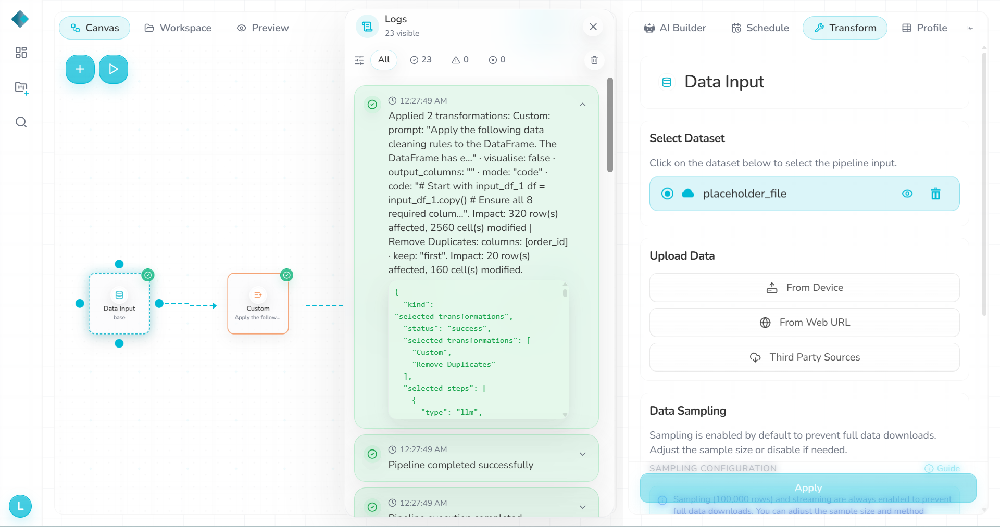
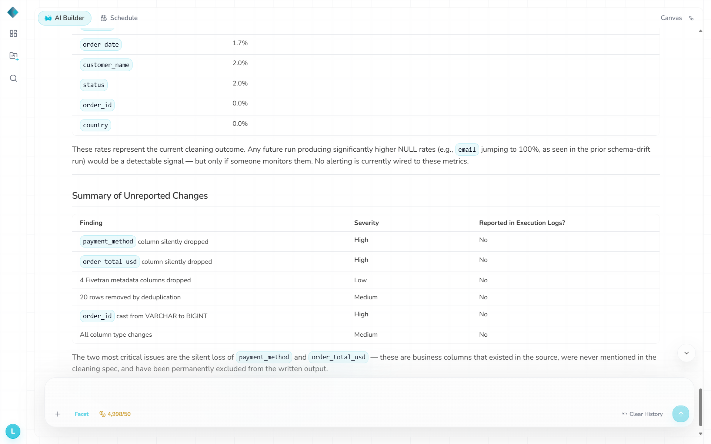

# D4 — Add `payment_method`

- **Change:** Added a ninth field, `payment_method` (`credit_card`, `paypal`, `bank_transfer`).
- **Expected:** Identify the new source field or explicitly document the fixed output schema.
- **Actual:** Pipeline **Success**, no warning. The new column was omitted; cleaned output was byte-identical (same SHA-256) to baseline. This matches the original AI Builder instruction to output exactly eight columns, but the upstream schema change was not surfaced.
- **Logs / chatbot:** No schema alert. When asked to compare input and output, the chatbot found `payment_method` missing but treated stale `order_total_usd`/ingestion metadata as current source data and characterized the required 20-row deduplication as unreported loss.
- **Repair:** No D4-specific repair.
- **Validation:** `d4.txt`: **0 FAIL, 1 DRIFT, 0 WARN**.
- **Files:** `datasets/Drift4_schema_add_column.csv`, `datasets/RhombusAI_output_2st_Pipeline_Drift_4.csv`, `observations/validation-output/d4.txt`.

## Evidence

**Logs**

**Chatbot**

