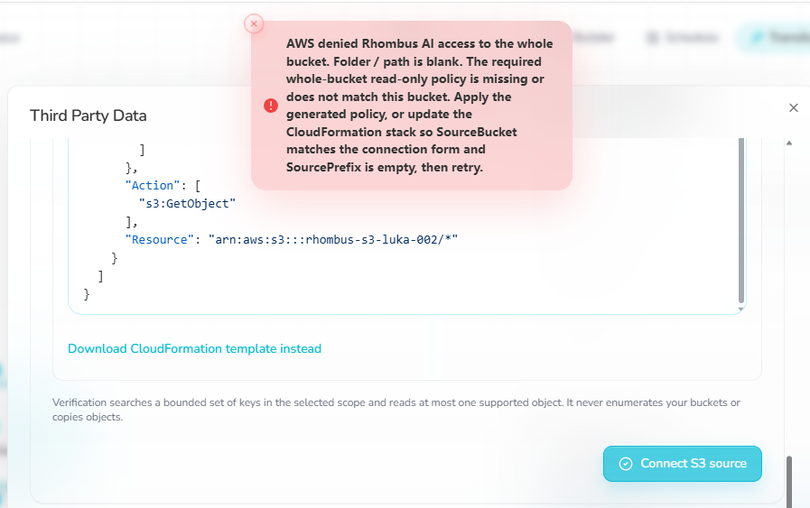
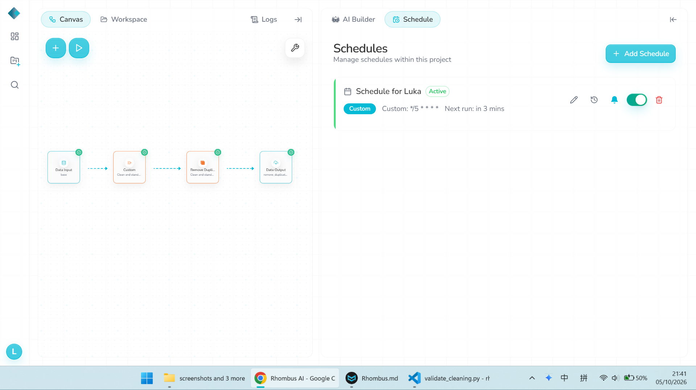
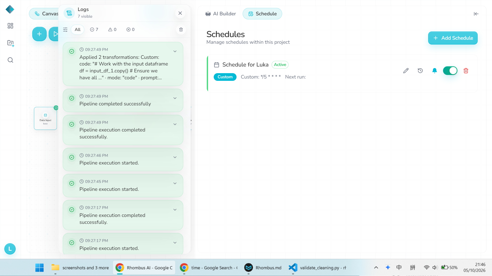
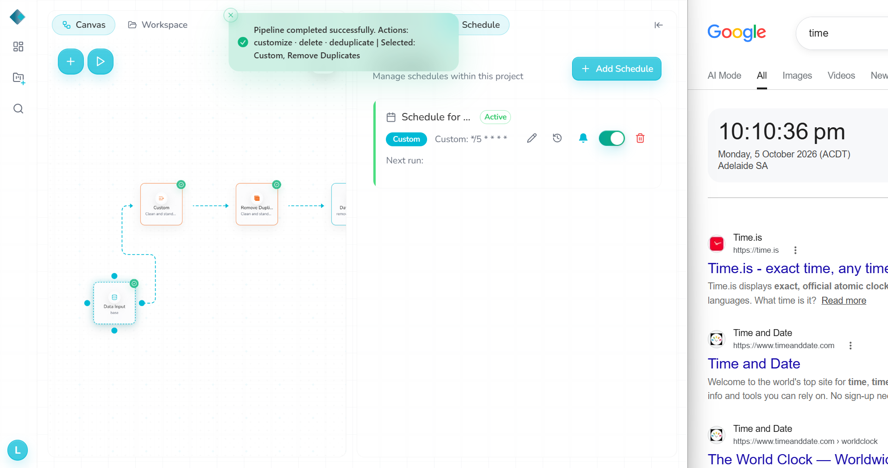
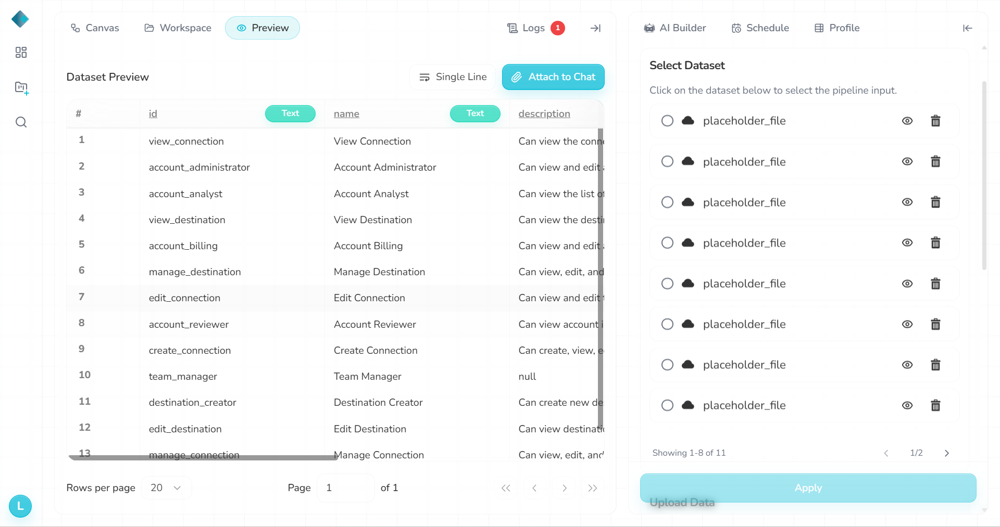

# Known issues and limitations

## AWS S3 source

The S3 connector repeatedly returned an access-denied error. CloudTrail showed a `GetBucketLocation` request from the Rhombus AWS account returning HTTP 403. Rhombus support confirmed the principal belonged to its production S3 role and approved GCS as a substitute source. The exact denying control was not established.

## Schedule reliability

Cron schedules (`*/10` and `*/5`) were inconsistent: `Next run` sometimes became blank, execution history remained empty, and expected times could pass without a new GCS output. Because trigger provenance was not reliable, drift cases were run manually. Schedule impact for each drift case is therefore **not verified**.

## GCS discovery / schema metadata

The source UI sometimes showed `placeholder_file` or ingestion-generated entries instead of the current bucket object list. Preview also retained removed fields such as `order_total_usd` and `payment_method` as `Unsupported / null`. Rhombus support described the extra entries as ingestion-generated metadata. The exact caching/ingestion behavior was not established.

## Evidence

**S3 error**

**Schedule active**

**Missed run**

**Canvas edit**

**GCS discovery mismatch**

