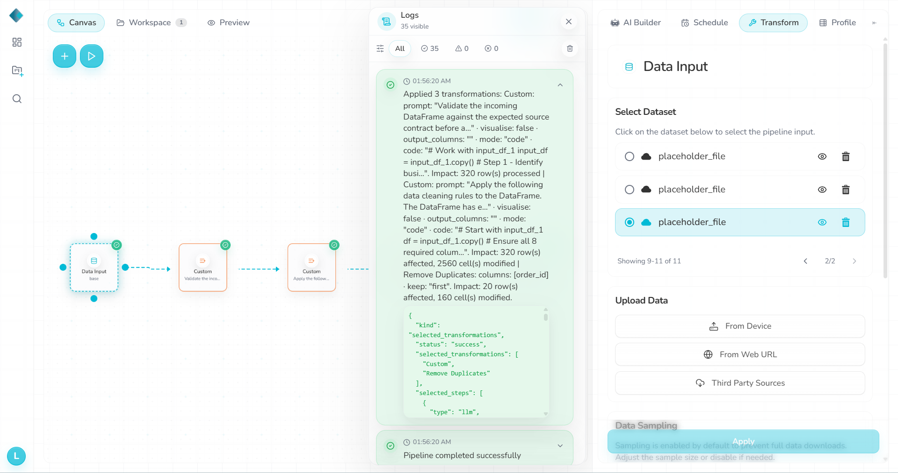
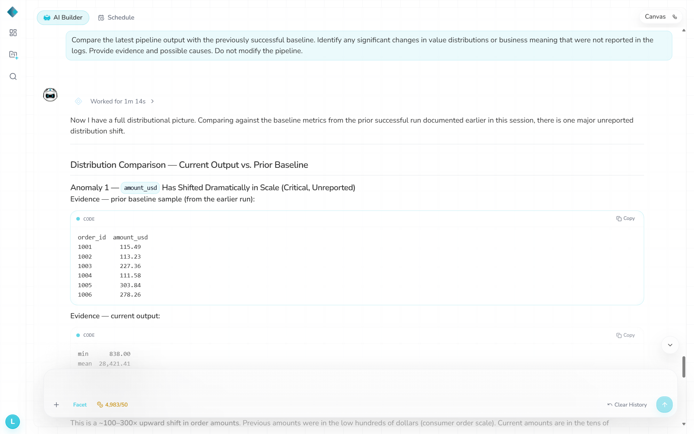

# S1 — USD amounts expressed as cents

- **Change:** Valid non-negative `amount_usd` source values were multiplied by 100 without renaming the field. Input schema unchanged: 320 × 8. Missing/invalid values remained unchanged.
- **Expected:** A semantic/range change should be noticed or reported; cleaning alone should not be treated as evidence that values are still USD.
- **Actual:** Repaired pipeline **Success**, **0 warnings/errors**. All **287** valid cleaned amounts were exactly 100× baseline; **13** NULL amounts remained NULL. Other fields, row order and deduplication remained stable.
- **Logs / chatbot:** No automatic detection. Asked to compare against prior baseline, chatbot found the magnitude shift and suggested range/distribution checks, but initially described it as roughly 100–300× rather than explicitly establishing USD → cents. This was a prompted, history-aware comparison, not a blind runtime alert.
- **Repair:** Recommended range checks only; **not applied**.
- **Validation:** `s1.txt`: **0 FAIL, 1 DRIFT, 0 WARN**; exact 100× confirmed against baseline.
- **Files:** `datasets/Semantic1_amount_cents.csv`, `datasets/RhombusAI_output_Semantic1.csv`, `observations/validation-output/s1.txt`.

## Evidence

**Run**

**Chatbot**

