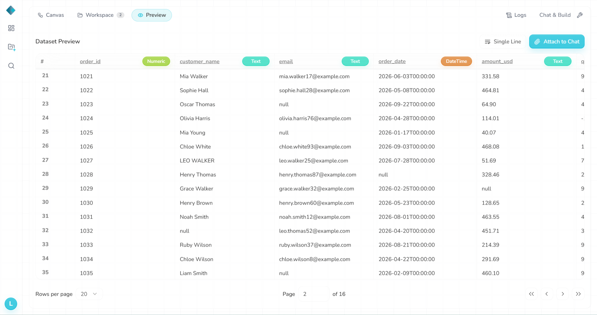
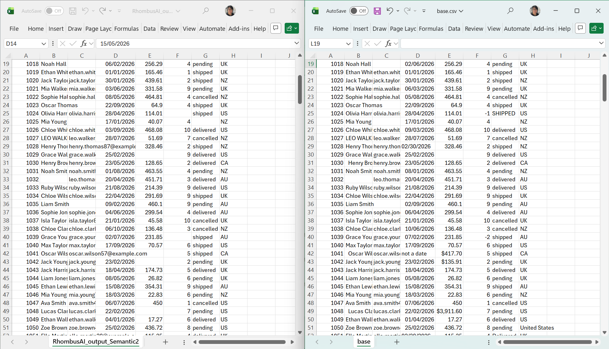
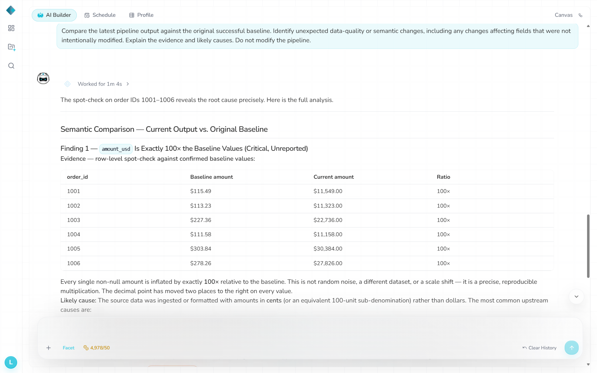

# S2 — DD/MM/YYYY source dates

- **Change:** Converted all **315 valid** baseline input dates from `MM/DD/YYYY` to `DD/MM/YYYY`, retaining five invalid-date entries and all other source fields; 320 × 8 input. This was a complete format switch, not a partial swap.
- **Expected:** Detect the semantic format change or prevent incorrect date interpretation. Existing cleaning rule explicitly expected `MM/DD/YYYY`.
- **Actual:** Repaired pipeline **Success**, **0 warnings/errors**. GCS Input Preview already showed plausible but wrong dates, e.g. order `1003`: intended Aug 3 → parsed Mar 8. Final output: **120** order dates silently differed from baseline (exact month/day swaps), **zero additional date NULLs** beyond the five original invalid dates. Separately, **14** unchanged, `$`-formatted amounts became NULL; cause not established.
- **Logs / chatbot:** No semantic alert. Chatbot instead analyzed an S1-like 100× amount increase, asserted dates were stable and missed the current date changes, despite being asked for the latest baseline comparison. Root cause of stale diagnosis not verified.
- **Repair:** Not attempted for S2.
- **Validation:** `s2.txt`: **2 cleaning-rule FAIL, 2 DRIFT, 0 WARN**. Under the documented strict `MM/DD/YYYY` rule, **167** source dates with day > 12 should have become NULL, but the output kept valid dates instead, indicating they were interpreted as `DD/MM/YYYY`. Separately, **120** ambiguous dates (day ≤ 12 and day ≠ month) were silently interpreted as a different valid date. The second rule FAIL concerns the 14 unchanged `$`-formatted amounts unexpectedly set to NULL. Preview evidence shows the date interpretation was already visible before cleaning; the exact parsing stage/cause was not verified.
- **Files:** `datasets/Semantic2_date_ddmm.csv`, `datasets/RhombusAI_output_Semantic2.csv`, `observations/validation-output/s2.txt`.

## Evidence

**Input Preview**

**Run**

**Chatbot**

